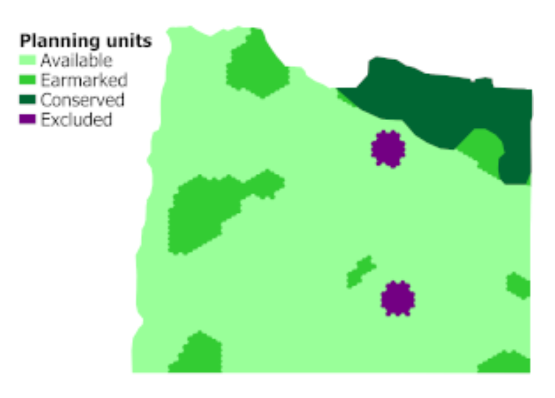
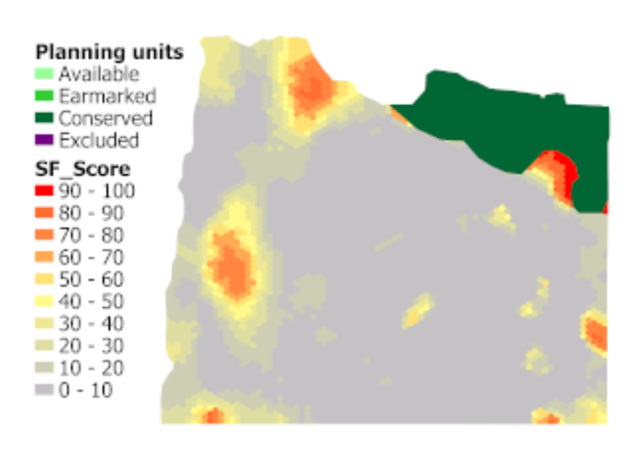
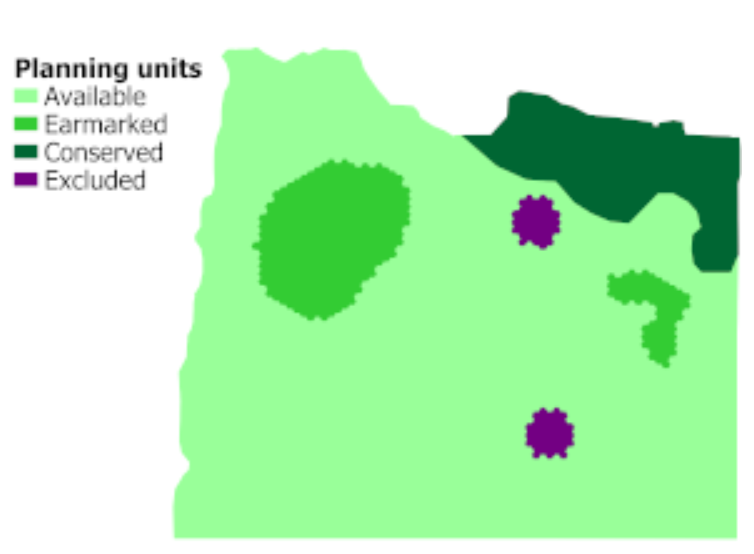

# CLUZ for designing ecological networks

**CLUZ** (Conservation Land-Use Zoning software) is a [QGIS](https://www.qgis.org/) plug-in that allows users to design conservation area networks and other conservation landscapes and seascapes. It can be used for on-screen planning and also acts as a link for the **Marxan** and **Marxan with Zones** conservation planning software. **CLUZ** was developed by **Bob Smith** and funded by the **UK Government's Darwin Initiative**.

[Marxan](https://marxansolutions.org/) was developed by researchers at The Ecology Centre of the University of Queensland. It is designed to identify priority areas for conservation that meet biodiversity targets, whilst minimising costs and achieving connectivity.

***CLUZ, Marxan, Marxan with Zones and QGIS are all freely available open-source software packages.***

**Sign up to the [CLUZ mailing list](https://kent.us19.list-manage.com/subscribe?u=c328b61dd6b0a361fc0910694&id=a23395174d) for updates on software and training resources.**

**CLUZ citation**: Smith, RJ (2019). [The CLUZ plugin for QGIS: designing conservation area systems and other ecological networks.](https://riojournal.com/article/33510/) Research Ideas and Outcomes 5, e33510.

## CLUZ overview

CLUZ and Marxan work by dividing the planning region into a series of planning units, listing the distribution of the conservation features found in each planning units, setting targets for the amount of each feature to be included in the ecological network and using computer software to identify portfolios of units that best meet these targets.

This video gives some background to the systematic conservation planning approach and then shows how to use CLUZ and Marxan to identify priority areas for conservation.

<iframe width="560" height="315" 
    src="https://www.youtube.com/embed/sl1_UYQOMW4?start=1" 
    title="YouTube video player" 
    frameborder="0" 
    allow="accelerometer; autoplay; clipboard-write; encrypted-media; gyroscope; picture-in-picture; web-share" 
    allowfullscreen>
</iframe>

## The CLUZ approach

The three ways that CLUZ can be used to develop these conservation land-use plans are:

---

### 1) Using Marxan to identify near-optimal conservation landscapes and seascapes

  

Marxan identifies near-optimal combinations of planning units that meet specified conservation targets. It does this by running the same analysis a set number of times and identifying the most efficient solution. Incorporating boundary costs into the process ensures that patches of contiguous units are selected, which increases the real-world applicability of the final outputs.

---

### 2) Using Marxan to produce selection frequency scores

  

Marxan also records the number of times that each unit is selected in each of the different runs. This selection frequency score can be seen as a measure of irreplaceability, so that units that are selected in every run could be considered irreplaceable (based on their biodiversity value, cost and importance for maintaining connectivity). CLUZ can display these scores and the resultant maps are valuable because they give a conservation value for each planning unit.

---

### 3) Using CLUZ to interactively create and modify existing plans

  

CLUZ can also be used to develop and modify conservation plans by interactively adding and removing units. These interactive functions automatically update information on how the selected units meet the conservation targets. CLUZ can also be used to display the distribution of each biodiversity element and to identify suitable units for swapping with selected units that are in unsuitable locations.

---

## The CLUZ files

CLUZ is a plugin for QGIS that is available for download through the QGIS Plugins Manager. CLUZ has been tested on **QGIS v3.0** and above but please install the latest version of [QGIS](https://www.qgis.org/).

**User guides**

[CLUZ Guide for Marxan](files/CLUZ_Marxan_guide.pdf)

[CLUZ Guide for Marxan with Zones](files/CLUZ_Marxan_with_Zones_guide.pdf)

**Tutorials**

Exercise 1

[CLUZ Tutorial Exercise 1: An introduction to CLUZ](files/CLUZ Tutorial 1.pdf)

[CLUZ Exercise 1 data](files/cluz_ex1.zip)

Exercise 2

[CLUZ Tutorial Exercise 2: Producing the CLUZ files](files/CLUZ Tutorial 2.pdf)

[CLUZ Exercise 2 data](files/cluz_ex2.zip)

---

## Links

* [Browse source code](https://github.com/AnotherBobSmith/CLUZ)

* [CLUZ on QGIS plugins repository](https://plugins.qgis.org/plugins/cluz/)

* [Marxan website](https://marxansolutions.org/)

* [Prioritizr website](https://prioritizr.net/)

---

**Version history**

**v2020.3.18** - Added "Convert raster layer to Marxan abundance data" function.

**v2019.12.2** - Fixed bugs and renamed fields in target table.

**v2019.1.14** - Initial version for QGIS 3.

**v2016.2.3** - Added "Identify features in selected units" and "Calculate portfolio characteristics" functions.

**v2016.2.2** - Fixed bug in "Change Status" panel.

**v2016.2.1** - Initial full version. Fixed bugs in "Launch MinPatch" and "Convert polyline or polygon themes to Marxan abundance data" functions.

**v2016.2.0** - Second experimental version including MinPatch.

**v2015.7.12** - Initial public release of experimental version.
